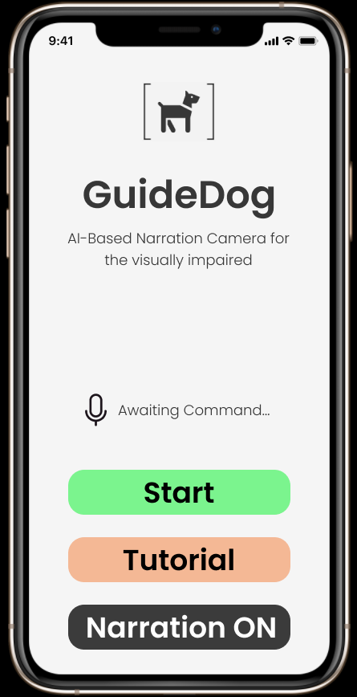

# GuideDog
**AI based narration camera for the visually impaired.**

### HackDuke 2020, Inequality Track.

Team: Franklin Boampong, Achilles Dabrowski, Samarth Lamba, Ryan Weeratunga, and Alex Xu

## Inspiration

People who are visually impaired face numerous challenges and inequalities including:
- Navigating environments.
- Recognizing and interacting with people and objects.
- Facing a world not designed for their particular needs in mind.

Existing solutions those who are visually impaired rely on include:
- Canes
- Service Animals/Dog
- Hearing and other senses
- Audio GPS systems

However, these options each contain their own unique set of pain points, including:
- **Limited** modalities of perception/sensing
- **Static** solutions can not update in real-time based on changing environments. Moving vehicles remain a constant danger.
- **Unreliable** - Information presented is not always certain or accurate.
- **Expensive** and sometimes require continuous maintenance (like a service animal)
- **Too Generalized** - Details can not be captured (e.g. signs, scaffolds, trees).

In an attempt to the help people with visual impairment, we wanted to create an app that is able to detect what is visible in front of a person and read out the objects to them.
**GuideDog will serve as a personal assistant for those who are visually impaired, and point out common objects and environmental features in an auditory way.**

## What it does 

GuideDog is a mobile application that utilizes machine learning to perform image recognition in real-time from the user's mobile phone camera. The system detects objects that are in front of a user. The application is designed to be used when the user is walking around, either outdoors or indoors.

Users can now walk around with added awareness of the objects and people around them. This increases convienence, minimizes safety risks, and reduces the disability inequality gap. Audio feature ensures that users can adequately understand objects in “sight” and anytime a new object appears, audio reminders are played.

** Core Features **
- Control via voice commands, to start/stop operation
- Text-to-speech user interface read outs for those who can not use the display-based UI
- Real-time image recognition with audio reminders of objects in the environment
- Warnings of impeding danger

## How we built it

The app was mainly developed with Python. We used a pre-trained visual object detection algorithm known as “You Only Look Once” (YOLOv3). This was trained on datasets containing 80 of the most commonly seen objects in daily life, such as people, vehicles, etc. The back end and front end were all in Python, with the user interface being implemented in Tkinter.

User interface, interaction, and wireframe mockups were developed in Figma: https://www.figma.com/proto/fr6T3UQ8CobZIAjzMoTwS3/Untitled?node-id=5%3A323&scaling=scale-down

Audio read-out and voice interaction features utilize Google's Text-to-Speech (gtts) API.

## How it works

I. Images are continuously captured by a local (mobile phone) or IP-connected camera.

II. Utilizes an image recognition algorithm that utilizes a pre-trained model based on YOLOv3. (Recognizes 80 of the most commonly found objects in daily life.)

III. Objects are detected in real-time and sent to the Google speech API that generates a voice-based message.

IV. Audio playback happens immediately to alert the user.

V. User can interact with GuideDog through voice commands.

## Challenges we ran into

The main challenges we ran into had to do with integrating the back end in Python to a front-end developed in Flutter for easy launch of a mobile app. 

## Accomplishments that we're proud of

The main accomplishment we are proud of is the accuracy with which our feature could predict objects and also being able to build a whole product centered on social good was very rewarding for us

## What we learned

We learned a lot, from new Machine learning models to understanding the main pain point on visually impaired individuals we understood a user need and solve the need with our product

## What's next

We plan to launch the product even after the hackathon as it could make a big impact on the lives of users. Planned features:

## Installation

Type this code into the command prompt/terminal:

	cd ~/DukeHackathon2020
	pip install -r requirements.txt
