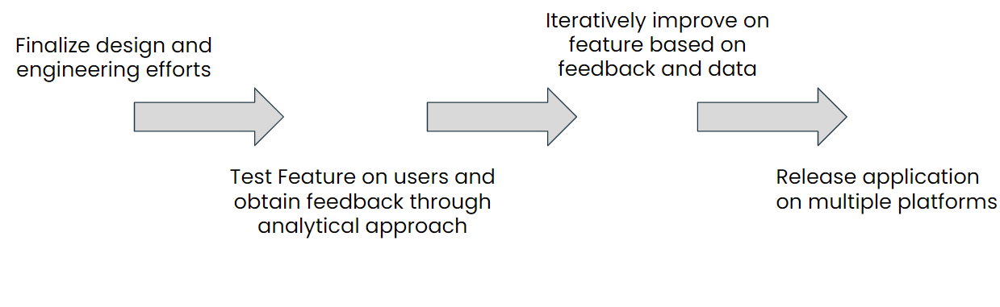

# GuideDog
**AI based narration camera for the visually impaired.**
HackDuke 2021

1. Inspiration 

In an attempt to the help people with visual impairment, we wanted to create an app that is able to detect what is visible in front of a person and read out the objects to them

2. What it does 

Utilizes Machine Learning and image recognition to determine what objects are in front of a user. 
Users can now walk around knowing that the world around them
Audio feature ensures that users can adequately understand objects in “sight” and anytime a new object appears, audio is played

3. How we built it

The app was mainly developed with Python. The main AI/Machine learning model used was “You Only Look Once” (YOLO v3) which made use of pre-trained data on object identification. The back end and front end were all in python.

4. How it works

I. Images are continuously captured by a local (mobile phone) or IP-connected camera.
II. Utilizes an image recognition algorithm that utilizes a pre-trained model based on YOLOv3. (Recognizes 80 of the most commonly found objects in daily life.)
III. Objects are detected in real-time and sent to the Google speech API that generates a voice-based message.
IV. Audio playback happens immediately to alert the user.
V. User can interact with GuideDog through voice commands.

5. Challenges we ran into

The main challenges we ran into had to do with integrating the back end in Python to a front-end developed in flutter for easy launch of a mobile app. 

6. Accomplishments that we're proud of

The main accomplishment we are proud of is the accuracy with which our feature could predict objects and also being able to build a whole product centered on social good was very rewarding for us

7. What we learned

We learned a lot, from new Machine learning models to understanding the main pain point on visually impaired individuals we understood a user need and solve the need with our product

8. What's next

We plan to launch the product even after the hackathon as it could make a big impact on the lives of users. Planned features:

9. Installation

Type this code into the command prompt/terminal:

	cd ~/DukeHackathon2020
	pip install -r requirements.txt
